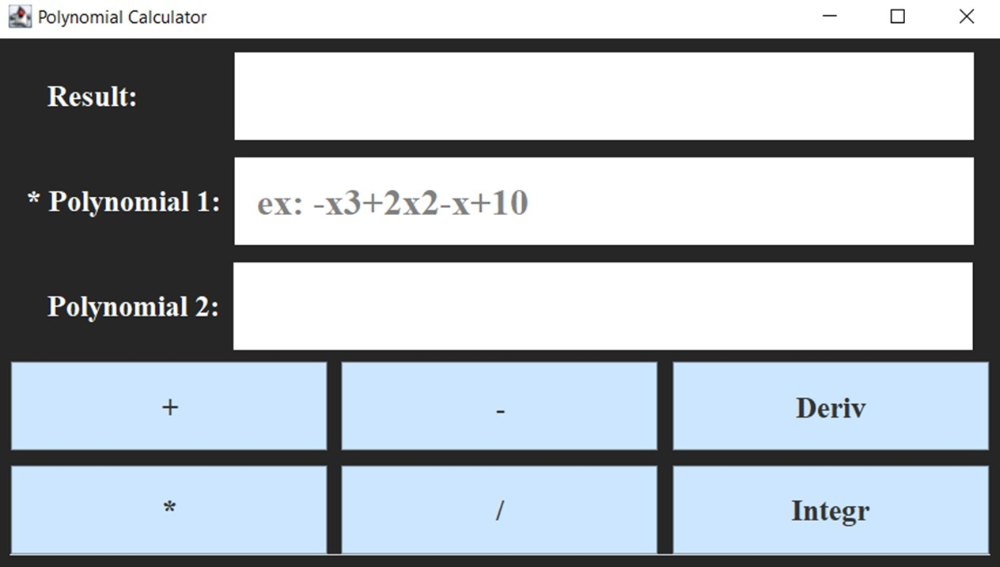
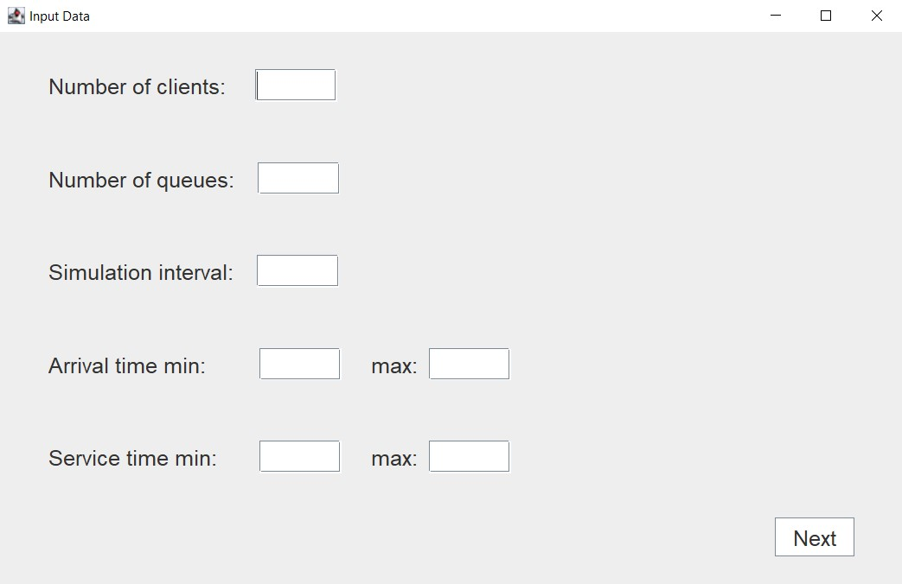
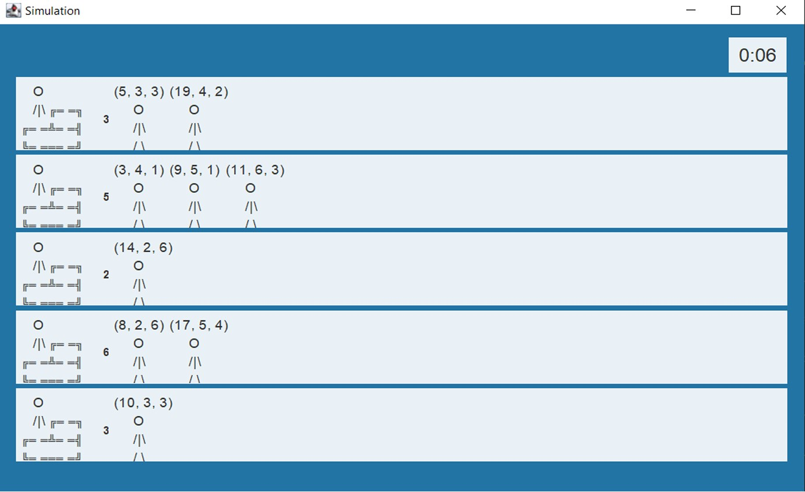
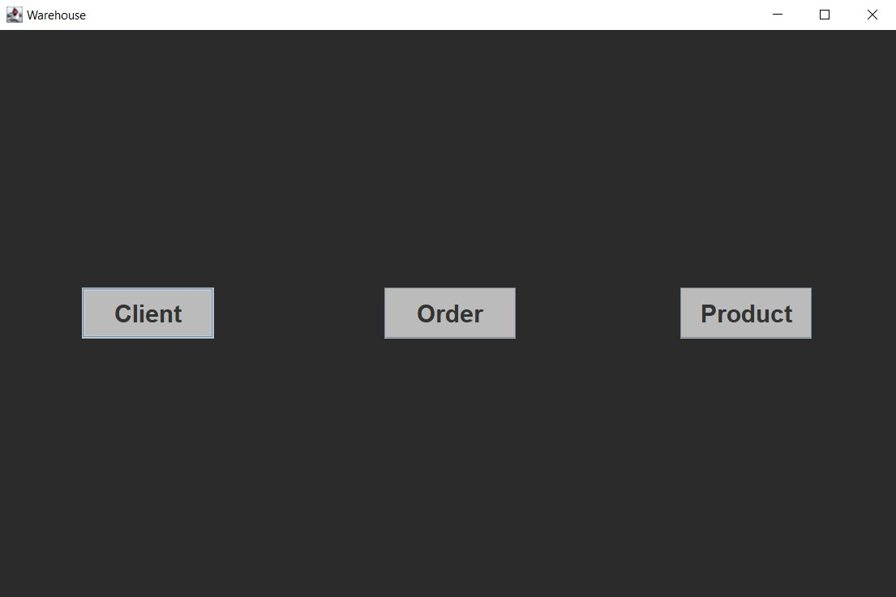
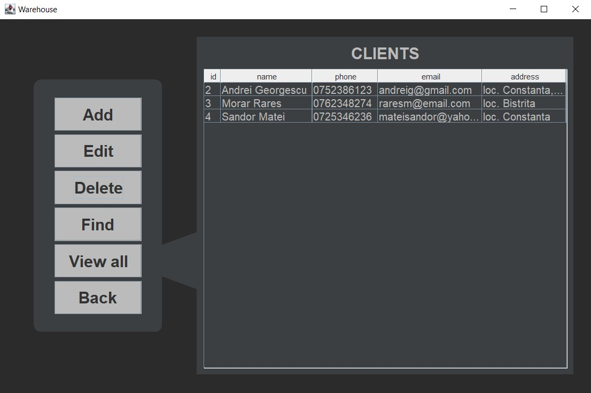

# Java-Projects

## Polynomial Calculator
A computer that can perform different operations on polynomials.  

## Threads
An application for managing queues using threads and synchronization mechanisms.  

## Warehouse
An application for managing orders received from customers for a warehouse.  

